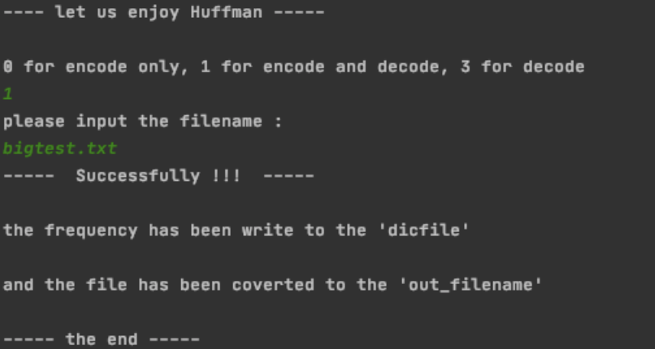

# A simple implement of Huffman coding

## Introduction

This is a simple implement of n-ary Huffman coding. In this project, we use 2\3\5\n -ary Huffman coding to code different type of file(e.g. .txt, .jpg, .zip), and we calculate the compression ratio.

```markdown
-- compare.py : compare compression ratio
-- demo.py : a simple demo
-- data : related documents
-- main.py : funstion main
```

## usage

please prepare the test.file in advance

```python
# you may need to change the path to the local path
# it may return :
# 		Traceback (most recent call last):
#   		File "main.py", line 8, in <module>
#     	from Huffman import demo


to run the demo code
 >> python3 main.py
  
to compare between 2\3\5-ary code
 >> python3 compare.py
```

you may get something like this: 



## Feature

- implement of n-ary Huffman coding
- Calculate the compression ratio of different files with n-ary Huffman coding

## Conclusion

We calculate the compression as below: 

| n\-ray | jpg/171k | txt/270k | mp3/3\.3M | pdf/831k |
| ------ | -------- | -------- | --------- | -------- |
| 2      | 99\.90%  | 56\.98%  | 99\.92%   | 99\.55%  |
| 3      | 103\.47% | 58\.16%  | 103\.74%  | 103\.08% |
| 4      | 100\.00% | 58\.01%  | 100\.00%  | 99\.78%  |
| 5      | 103\.91% | 57\.86%  | 104\.69%  | 104\.01% |
| 6      | 101\.93% | 57\.58%  | 102\.48%  | 102\.11% |
| 7      | 103\.06% | 58\.07%  | 103\.43%  | 102\.50% |
| 8      | 105\.23% | 57\.83%  | 105\.97%  | 105\.04% |
| 9      | 105\.52% | 57\.51%  | 106\.26%  | 105\.73% |
| 10     | 105\.57% | 57\.22%  | 106\.73%  | 105\.95% |
| 11     | 104\.35% | 57\.18%  | 105\.33%  | 104\.78% |
| 12     | 104\.10% | 57\.27%  | 104\.98%  | 104\.21% |
| 13     | 103\.51% | 57\.28%  | 104\.33%  | 103\.61% |
| 14     | 102\.71% | 57\.43%  | 103\.94%  | 103\.51% |
| 15     | 101\.21% | 57\.39%  | 101\.92%  | 101\.59% |
| 16     | 100\.00% | 57\.30%  | 100\.00%  | 100\.00% |
| 17     | 100\.93% | 57\.19%  | 100\.71%  | 100\.11% |
| 18     | 101\.71% | 57\.09%  | 101\.50%  | 100\.57% |
| 19     | 102\.79% | 57\.03%  | 102\.66%  | 101\.69% |
| 20     | 103\.53% | 57\.03%  | 103\.53%  | 102\.47% |
| 21     | 104\.14% | 57\.04%  | 104\.23%  | 103\.10% |
| 22     | 104\.96% | 57\.09%  | 104\.98%  | 103\.81% |
| 23     | 105\.62% | 57\.09%  | 105\.83%  | 104\.62% |
| 24     | 106\.14% | 57\.05%  | 106\.23%  | 105\.00% |
| 25     | 106\.81% | 57\.04%  | 107\.08%  | 105\.80% |
| 26     | 107\.18% | 57\.03%  | 107\.38%  | 106\.11% |
| 27     | 107\.49% | 57\.06%  | 107\.82%  | 106\.50% |
| 28     | 107\.92% | 57\.03%  | 108\.57%  | 107\.27% |
| 29     | 107\.88% | 57\.00%  | 108\.53%  | 107\.25% |
| 30     | 108\.16% | 57\.01%  | 108\.87%  | 107\.63% |
| 31     | 108\.47% | 57\.02%  | 109\.30%  | 108\.15% |
| 32     | 108\.40% | 57\.04%  | 109\.21%  | 108\.01% |